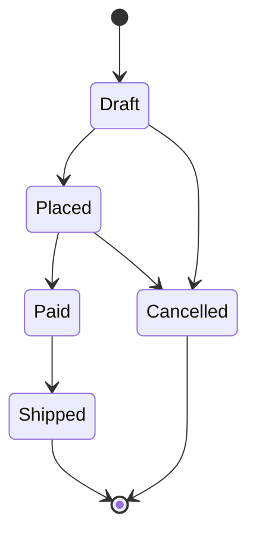

# Order Management API – Model Domenowy

Wersja: 1.0  
Cel: Szkolenie – Projektowanie modelu domenowego dla REST API  

---

# 1. Wprowadzenie

Model domenowy opisuje zachowanie systemu niezależnie od technologii implementacji.

Nie zawiera:
- kodów statusu HTTP
- kontrolerów
- DTO
- mechanizmów serializacji

Zawiera:
- reguły biznesowe
- kontrolę przejść stanów
- logikę obliczeniową
- ochronę niezmienników

---

# 2. Agregat Order

Order jest agregatem głównym (Aggregate Root).

Odpowiada za:
- kontrolę cyklu życia
- walidację przejść stanów
- kontrolę pozycji zamówienia
- inkrementację wersji (Version)

---

## 2.1 Struktura logiczna

```
Order
 ├── Id (Guid)
 ├── CustomerId (Guid)
 ├── CreatedAt (DateTimeOffset)
 ├── Status (OrderStatus)
 ├── Version (int)
 ├── Items (List<OrderItem>)
 └── TotalAmount (decimal – wyliczane)
```

---

# 3. OrderStatus

```csharp
public enum OrderStatus
{
    Draft,
    Placed,
    Paid,
    Shipped,
    Cancelled
}
```

---

# 4. Cykl życia zamówienia

Dozwolone przejścia:

```
Draft → Placed  
Placed → Paid  
Paid → Shipped  
Draft → Cancelled  
Placed → Cancelled  
```

Stany końcowe:
- Shipped
- Cancelled

Niedozwolone przejścia powinny skutkować wyjątkiem domenowym.



---

# 5. OrderItem

```
OrderItem
 ├── ProductId (Guid)
 ├── Quantity (int > 0)
 ├── UnitPrice (decimal >= 0)
 └── LineTotal (Quantity * UnitPrice)
```

Reguły:
- Quantity > 0
- UnitPrice >= 0

---

# 6. Reguły biznesowe

## 6.1 Tworzenie

- Nowe zamówienie ma status `Draft`
- CreatedAt ustawiane jest w momencie utworzenia

---

## 6.2 Dodawanie pozycji

- Możliwe tylko w stanie `Draft`
- Ilość musi być większa od 0
- Cena nie może być ujemna

---

## 6.3 Składanie zamówienia

Możliwe tylko gdy:
- Status = Draft
- Istnieje co najmniej jedna pozycja

---

## 6.4 Płatność

Możliwa tylko gdy:
- Status = Placed

---

## 6.5 Wysyłka

Możliwa tylko gdy:
- Status = Paid

---

## 6.6 Anulowanie

Możliwe tylko gdy:
- Status = Draft
- Status = Placed

Nie można anulować:
- Zamówienia opłaconego
- Zamówienia wysłanego

---

# 7. Kontrola współbieżności

Order posiada pole:

```
Version (int)
```

Zasady:
- Version zwiększa się przy każdej zmianie
- Wersja służy jako concurrency token
- Konflikt wersji obsługiwany jest na poziomie HTTP (412)

Model domenowy jedynie inkrementuje Version.

---

# 8. Ochrona niezmienników

Model musi gwarantować:
- Brak nielegalnych przejść stanów
- Brak ujemnych cen
- Brak zerowej ilości
- Brak modyfikacji pozycji poza Draft
- Spójność TotalAmount

---

# 9. Przykładowe metody agregatu

```csharp
public class Order
{
    public void AddItem(Guid productId, int quantity, decimal unitPrice);
    public void Place();
    public void Pay();
    public void Ship();
    public void Cancel();
}
```

Każda metoda:
- Sprawdza aktualny stan
- Weryfikuje reguły biznesowe
- Inkrementuje Version
- Rzuca wyjątek domenowy w przypadku naruszenia zasad

---

# 10. Wyjątki domenowe

Przykłady:
- InvalidStateTransitionException
- BusinessRuleViolationException
- OrderAlreadyPaidException

Wyjątki domenowe:
- Nie zawierają informacji o HTTP
- Są mapowane na kody statusu w warstwie API

---

# 11. Co nie należy do modelu domenowego

Model domenowy nie powinien zawierać:
- Kodów statusu HTTP
- ProblemDetails
- DTO
- Logiki serializacji
- Dostępu do bazy danych
- Logiki autoryzacji

---

# 12. Podsumowanie

Model domenowy:
- Jest niezależny od technologii
- Chroni reguły biznesowe
- Kontroluje cykl życia zamówienia
- Zapewnia spójność danych
- Stanowi fundament dla poprawnego REST API