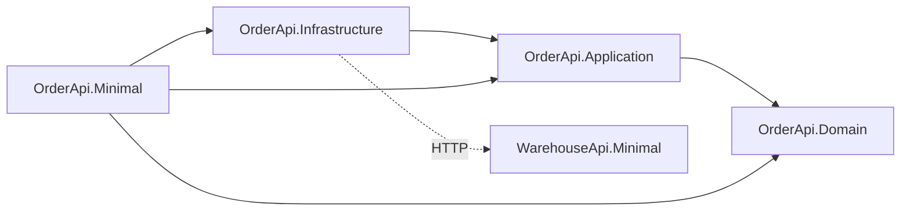

# Order API – Source Code

Katalog `src/` zawiera implementację aplikacji Order Management API.

Projekt został przygotowany jako materiał szkoleniowy do kursu:

> Tworzenie usług REST API w .NET 9

---

# Struktura katalogu

```
src/
│
├── OrderApi.Domain/           → Model domenowy (reguły biznesowe, encje, przejścia stanów)
├── OrderApi.Application/      → Warstwa przypadków użycia (kontrakty, DTO, handlery)
├── OrderApi.Infrastructure/   → Repozytoria i integracje (NBP, Warehouse HTTP client)
├── OrderApi.Minimal/          → Host HTTP Order API (Minimal API, SignalR, dashboard)
│   ├── Endpoints/             → Mapowanie ścieżek REST na handlery
│   ├── Hubs/                  → SignalR – OrdersHub (subskrypcje powiadomień o zamówieniach)
│   ├── MessageHandlers/       → JwtPropagationHandler – przekazywanie JWT do wychodzących HTTP
│   ├── Middlewares/           → LoggerMiddleware, StopwatchMiddleware
│   ├── ProblemDetails/        → Globalna obsługa wyjątków → ProblemDetails
│   ├── Services/              → SignalROrderStatusNotifier (implementacja IOrderStatusNotifier)
│   └── wwwroot/               → Dashboard (HTML/JS), biblioteka SignalR, orders.js
└── WarehouseApi.Minimal/      → Osobny mikroserwis – endpoint rezerwacji produktu (używany przez OrderApi)
```

W bieżącym repozytorium hostem Order API jest wyłącznie **OrderApi.Minimal**; projekt OrderApi.Mvc nie jest uwzględniony. **WarehouseApi.Minimal** to minimalny serwis z endpointem rezerwacji, wywoływanym przez `WarehouseService` z Infrastructure.

Projekty testów znajdują się w katalogu **`tests/`** w głównym katalogu repozytorium (poza `src/`).

---

# Projekty i warstwy

| Projekt | Typ | Rola | Główne elementy |
|--------|-----|------|------------------|
| **OrderApi.Domain** | Biblioteka | Model domenowy, reguły biznesowe, brak zależności od innych warstw | `Order`, `OrderItem`, `OrderStatus`, przejścia stanów, wyjątki domenowe |
| **OrderApi.Application** | Biblioteka | Kontrakty aplikacyjne: repozytoria, serwisy zewnętrzne, DTO, handlery | `IOrderRepository`, `ICurrencyRateService`, `IWarehouseService`, `IOrderStatusNotifier`, `CreateOrderRequest` / `UpdateOrderStatusRequest`, `CreateOrderHandler`, `GetOrderHandler`, `UpdateOrderStatusHandler` |
| **OrderApi.Infrastructure** | Biblioteka | Implementacja persystencji i integracji zewnętrznych | `InMemoryOrderRepository`, `NbpApiCurrencyRateService` (NBP API), `WarehouseService` (HTTP client do WarehouseApi – rezerwacje) |
| **OrderApi.Minimal** | Aplikacja webowa | Host HTTP – Minimal API, SignalR, kompozycja warstw, endpointy REST | `Program.cs`, `OrderApiEndpoints`, `OrdersHub` (SignalR – subskrypcja zamówień), `SignalROrderStatusNotifier`, `JwtPropagationHandler` (JWT do wychodzących wywołań), ProblemDetails, middlewares (`LoggerMiddleware`, `StopwatchMiddleware`), dashboard w `wwwroot/` |
| **WarehouseApi.Minimal** | Aplikacja webowa | Mikroserwis rezerwacji – endpoint używany przez OrderApi | `Program.cs`, endpoint `POST /products/{id}/reservations`, `warehouse.http` |

---

# Relacje między projektami

- **OrderApi.Domain** – bez zależności od innych projektów (warstwa bazowa).
- **OrderApi.Application** – zależy tylko od **OrderApi.Domain** (używa encji domenowych w kontraktach).
- **OrderApi.Infrastructure** – zależy od **OrderApi.Application** (implementuje interfejsy z Application, np. `IOrderRepository`, `IWarehouseService`).
- **OrderApi.Minimal** – host łączy wszystkie warstwy: używa Application (kontrakty, DTO, handlery), Domain (encje, logika), Infrastructure (repozytorium, serwisy); dodatkowo SignalR (OrdersHub, SignalROrderStatusNotifier) i JWT propagation do wywołań Warehouse API.
- **WarehouseApi.Minimal** – niezależny mikroserwis (brak referencji do OrderApi); wywoływany przez **OrderApi.Infrastructure** (`WarehouseService`).



---

# Założenia architektoniczne

- REST traktujemy jako kontrakt HTTP
- Logika biznesowa znajduje się w modelu domenowym
- Warstwa HTTP mapuje wyjątki domenowe na statusy HTTP
- Repozytorium abstrahuje warstwę przechowywania danych
- Minimal API (i ewentualnie MVC) implementują ten sam kontrakt

---

# Odpowiedzialności warstw

## Domain

Zawiera:

- agregat `Order` (fabryka `Order.Create`, `AddItem`, `TransitionTo`, `Version`, `Total`)
- `OrderItem`
- `OrderStatus`
- wyjątki domenowe
- reguły biznesowe (np. dozwolone przejścia stanów: Draft → Placed → Paid, anulowanie)

Zależności: brak (żadnego innego projektu z `src/`).

---

## Application

Odpowiada za:

- kontrakty repozytoriów (`IOrderRepository`) oraz serwisów zewnętrznych (`ICurrencyRateService`, `IWarehouseService`, `IOrderStatusNotifier`)
- DTO żądań i odpowiedzi (`CreateOrderRequest`, `UpdateOrderStatusRequest`)
- handlery przypadków użycia (`CreateOrderHandler`, `GetOrderHandler`, `UpdateOrderStatusHandler`) – orkiestracja między HTTP a domeną, wywołania serwisów i notyfikacje

Zależności: tylko **OrderApi.Domain**.

---

## Infrastructure

Zawiera:

- implementacje repozytoriów (`InMemoryOrderRepository`)
- implementację serwisu kursów walut (`NbpApiCurrencyRateService` – integracja z NBP API)
- `WarehouseService` – klient HTTP do WarehouseApi.Minimal (rezerwacja produktu `POST /products/{id}/reservations`)

Zależności: **OrderApi.Application** (oraz transitowo Domain).

---

## Minimal (host HTTP) – OrderApi.Minimal

W tym repozytorium host Order API to **OrderApi.Minimal**. Odpowiada za:

- mapowanie endpointów HTTP na operacje aplikacyjne (`Endpoints/OrderApiEndpoints.cs`)
- obsługę żądań i odpowiedzi HTTP, walidację wejścia
- globalną obsługę wyjątków (`ConfigureExceptionHandler`, ProblemDetails) – mapowanie wyjątków domenowych na statusy HTTP (np. 409, 422)
- obsługę ETag (optymistyczna współbieżność)
- middlewares (`LoggerMiddleware`, `StopwatchMiddleware`)
- **SignalR**: `OrdersHub` (klienci subskrybują grupy `order-{id}`), `SignalROrderStatusNotifier` (wysyła powiadomienia o zmianie statusu zamówienia)
- **JWT**: `JwtPropagationHandler` – przekazuje nagłówek Authorization z bieżącego żądania do wychodzących wywołań HTTP (np. do WarehouseApi)
- dashboard w `wwwroot/` (HTML, SignalR client, `orders.js`)

Host nie zawiera logiki biznesowej – korzysta z Application i Domain; konkretna implementacja persystencji i serwisów jest wstrzykiwana z Infrastructure.

---

## WarehouseApi.Minimal

Osobny mikroserwis (minimalny host), udostępniający endpoint rezerwacji produktu. Używany przez **OrderApi** przez `WarehouseService` (Infrastructure). Nie zależy od OrderApi; może być uruchamiany osobno (np. `dotnet run --project src/WarehouseApi.Minimal`). Pliki: `Program.cs`, `warehouse.http`, konfiguracja w `appsettings.json`.

---

# Testy

W katalogu **`tests/`** (w głównym katalogu repozytorium) znajdują się:

| Projekt | Zależności | Opis |
|--------|------------|------|
| **OrderApi.Domain.UnitTests** | OrderApi.Domain | Testy encji i logiki domenowej (`Order.Create`, `AddItem`, `TransitionTo`, walidacje) |
| **OrderApi.Application.UnitTests** | OrderApi.Application | Testy handlerów przypadków użycia (np. `CreateOrderHandler`) z fikcyjnym repozytorium |
| **OrderApi.IntegrationTests** | OrderApi.Minimal | Testy API na poziomie HTTP (endpointy, statusy, kontrakt) |

Uruchomienie testów z katalogu głównego:

```bash
dotnet test
```

---

# Uruchomienie aplikacji

Z poziomu katalogu głównego projektu:

```bash
# Order API (główny host – REST + SignalR)
dotnet run --project src/OrderApi.Minimal

# Warehouse API (mikroserwis rezerwacji – uruchamiany osobno, gdy używana jest rezerwacja)
dotnet run --project src/WarehouseApi.Minimal
```
