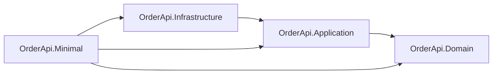

# Order API – Source Code

Katalog `src/` zawiera implementację aplikacji Order Management API.

Projekt został przygotowany jako materiał szkoleniowy do kursu:

> Tworzenie usług REST API w .NET 9

---

# Struktura katalogu

```
src/
│
├── OrderApi.Domain/         → Model domenowy (reguły biznesowe)
├── OrderApi.Application/    → Warstwa przypadków użycia (kontrakty, DTO)
├── OrderApi.Infrastructure/ → Repozytoria i integracje
└── OrderApi.Minimal/        → Host HTTP (Minimal API)
```

W bieżącym repozytorium hostem jest wyłącznie **OrderApi.Minimal**; projekt OrderApi.Mvc nie jest uwzględniony.

Projekty testów znajdują się w katalogu **`tests/`** w głównym katalogu repozytorium (poza `src/`).

---

# Projekty i warstwy

| Projekt | Typ | Rola | Główne elementy |
|--------|-----|------|------------------|
| **OrderApi.Domain** | Biblioteka | Model domenowy, reguły biznesowe, brak zależności od innych warstw | `Order`, `OrderItem`, `OrderStatus`, przejścia stanów, wyjątki domenowe |
| **OrderApi.Application** | Biblioteka | Kontrakty aplikacyjne: repozytoria, DTO, interfejsy przypadków użycia | `IOrderRepository`, `ICurrencyRateService`, `CreateOrderRequest`, `UpdateOrderStatusRequest`, `CreateOrderHandler`, `GetOrderHandler` |
| **OrderApi.Infrastructure** | Biblioteka | Implementacja persystencji i integracji zewnętrznych | `Repositories/InMemoryOrderRepository` (implementacja `IOrderRepository`), `NbpApiCurrencyRateService` (implementacja `ICurrencyRateService`) |
| **OrderApi.Minimal** | Aplikacja webowa | Host HTTP – Minimal API, kompozycja warstw, endpointy REST | `Program.cs`, `Endpoints/OrderApiEndpoints`, rejestracja DI, `ConfigureExceptionHandler` / ProblemDetails, middlewares (`LoggerMiddleware`, `StopwatchMiddleware`) |

---

# Relacje między projektami

- **OrderApi.Domain** – bez zależności od innych projektów (warstwa bazowa).
- **OrderApi.Application** – zależy tylko od **OrderApi.Domain** (używa encji domenowych w kontraktach).
- **OrderApi.Infrastructure** – zależy od **OrderApi.Application** (implementuje interfejsy z Application, np. `IOrderRepository`).
- **OrderApi.Minimal** – host łączy wszystkie warstwy: używa Application (kontrakty, DTO), Domain (encje, logika), Infrastructure (konkretne repozytorium).



---

# Założenia architektoniczne

- REST traktujemy jako kontrakt HTTP
- Logika biznesowa znajduje się w modelu domenowym
- Warstwa HTTP mapuje wyjątki domenowe na statusy HTTP
- Repozytorium abstrahuje warstwę przechowywania danych
- Minimal API (i ewentualnie MVC) implementują ten sam kontrakt

---

# Odpowiedzialności warstw

## Domain

Zawiera:

- agregat `Order` (fabryka `Order.Create`, `AddItem`, `TransitionTo`, `Version`, `Total`)
- `OrderItem`
- `OrderStatus`
- wyjątki domenowe
- reguły biznesowe (np. dozwolone przejścia stanów: Draft → Placed → Paid, anulowanie)

Zależności: brak (żadnego innego projektu z `src/`).

---

## Application

Odpowiada za:

- kontrakty repozytoriów (np. `IOrderRepository`) oraz serwisów zewnętrznych (np. `ICurrencyRateService`)
- DTO żądań i odpowiedzi (`CreateOrderRequest`, `UpdateOrderStatusRequest`)
- handlery przypadków użycia (`CreateOrderHandler`, `GetOrderHandler`) – warstwa orkiestracji między HTTP a domeną

Zależności: tylko **OrderApi.Domain**.

---

## Infrastructure

Zawiera:

- implementacje repozytoriów (np. `Repositories/InMemoryOrderRepository`)
- implementację serwisu kursów walut (`NbpApiCurrencyRateService` – integracja z NBP API)
- integracje z bazą danych lub innymi systemami zewnętrznymi

Zależności: **OrderApi.Application** (oraz transitowo Domain).

---

## Minimal (host HTTP)

W tym repozytorium jedyny host to **OrderApi.Minimal**. Odpowiada za:

- mapowanie endpointów HTTP na operacje aplikacyjne (`Endpoints/OrderApiEndpoints.cs`)
- obsługę żądań i odpowiedzi HTTP
- walidację wejścia
- globalną obsługę wyjątków (`ConfigureExceptionHandler`, ProblemDetails) – mapowanie wyjątków domenowych na statusy HTTP (np. 409, 422)
- obsługę ETag (optymistyczna współbieżność)
- middlewares (np. logowanie – `LoggerMiddleware`, pomiar czasu – `StopwatchMiddleware`)

Host nie zawiera logiki biznesowej – korzysta z Application i Domain; konkretna implementacja persystencji jest wstrzykiwana z Infrastructure.

---

# Testy

W katalogu **`tests/`** (w głównym katalogu repozytorium) znajdują się:

| Projekt | Zależności | Opis |
|--------|------------|------|
| **OrderApi.Domain.UnitTests** | OrderApi.Domain | Testy encji i logiki domenowej (`Order.Create`, `AddItem`, `TransitionTo`, walidacje) |
| **OrderApi.Application.UnitTests** | OrderApi.Application | Testy handlerów przypadków użycia (np. `CreateOrderHandler`) z fikcyjnym repozytorium |
| **OrderApi.IntegrationTests** | OrderApi.Minimal | Testy API na poziomie HTTP (endpointy, statusy, kontrakt) |

Uruchomienie testów z katalogu głównego:

```bash
dotnet test
```

---

# Uruchomienie aplikacji

Z poziomu katalogu głównego projektu:

```bash
dotnet run --project src/OrderApi.Minimal
```
